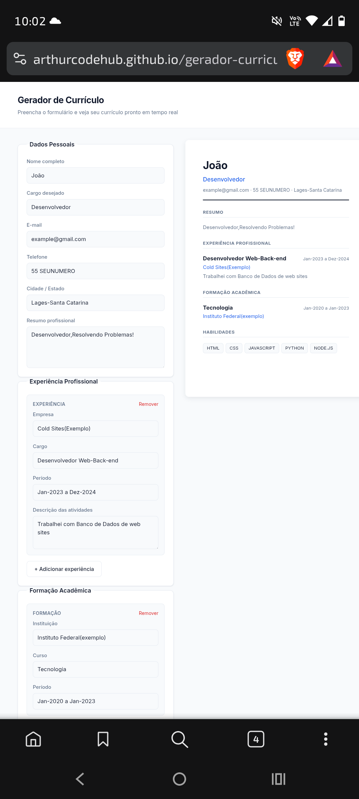
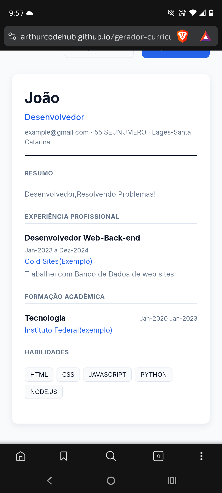

# Gerador de Currículo

Aplicação web para criar currículos profissionais com pré-visualização em tempo real e exportação em PDF. Desenvolvida com HTML, CSS e JavaScript puro, sem frameworks ou dependências externas.


## Demonstração

🔗 [Acesse o projeto online](https://arthurcodehub.github.io/gerador-curriculo/)







## Funcionalidades

- Formulário organizado em seções: dados pessoais, experiência, formação e habilidades
- Pré-visualização do currículo atualizada em tempo real, no formato de folha A4
- Adição e remoção dinâmica de itens de experiência e formação
- Salvamento automático no navegador (localStorage) — o progresso não se perde ao recarregar a página
- Exportação para PDF via impressão do navegador
- Validação de campos obrigatórios com feedback visual e mensagens acessíveis
- Interface responsiva, adaptada para desktop e mobile
- Navegação por teclado e suporte a leitores de tela (skip link, aria-live, aria-invalid)

## Qualidade e Performance

Auditado com [Google PageSpeed Insights](https://pagespeed.web.dev/):

| Categoria | Nota |
|---|---|
| Performance | 93/100 |
| Accessibility | 100/100 |
| Best Practices | 100/100 |
| SEO | 100/100 |

## Tecnologias

- HTML5 semântico
- CSS3 (Grid, Flexbox, variáveis CSS, media print)
- JavaScript (ES6+), sem bibliotecas ou frameworks

## Como rodar o projeto

Como é um projeto estático (sem back-end), basta abrir o index.html no navegador. Recomenda-se usar um servidor local para evitar restrições do navegador com módulos e requisições locais.

Clonar o repositório:

```
git clone https://github.com/Arthurcodehub/gerador-curriculo.git
cd gerador-curriculo
```

Depois, abra index.html com a extensão Live Server (VS Code) ou rode:

```
python3 -m http.server 8000
```

E acesse http://localhost:8000 no navegador.

## Estrutura do projeto

<!-- TREE_START -->
```
.
├── assets
│   ├── icons
│   │   ├── android-chrome-192x192.png
│   │   ├── android-chrome-512x512.png
│   │   ├── apple-touch-icon.png
│   │   ├── favicon-16x16.png
│   │   ├── favicon-32x32.png
│   │   ├── favicon.ico
│   │   └── site.webmanifest
│   └── screenshots
│       ├── desktop.png
│       └── mobile.png
├── css
│   ├── print.css
│   ├── reset.css
│   └── style.css
├── js
│   ├── app.js
│   ├── form.js
│   ├── pdf.js
│   ├── preview.js
│   └── storage.js
├── LICENSE
├── README.md
├── index.html
└── update-tree.sh

6 directories, 21 files
```
<!-- TREE_END -->

## Decisões técnicas

- Sem frameworks: projeto pensado para reforçar fundamentos de JavaScript puro (manipulação de DOM, eventos, localStorage)
- Arquitetura modular: cada arquivo JS tem uma responsabilidade única (captura de dados, renderização, persistência), facilitando manutenção e leitura
- Exportação via impressão: em vez de bibliotecas de geração de PDF, usa window.print() combinado com CSS media print, mantendo o projeto leve e sem dependências

## Melhorias futuras

- [ ] Múltiplos modelos/temas de currículo
- [ ] Upload de foto de perfil
- [ ] Exportação direta em PDF sem passar pela caixa de diálogo de impressão

## Autor

Desenvolvido por [Arthur](https://github.com/Arthurcodehub) como projeto de portfólio.
